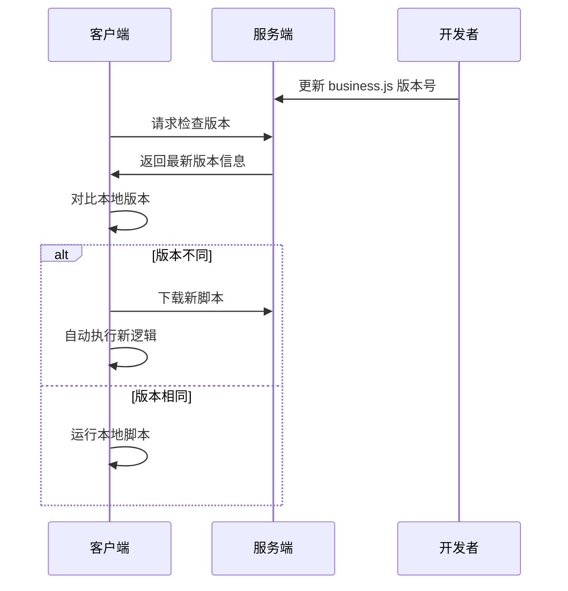

# 🤖 AutoOCR - 端云协同智能自动化框架

[](https://github.com/kkevsekk1/AutoX)
[](https://www.python.org/)
[](LICENSE)

> 🚀 **新一代端云协同自动化解决方案** - 集成 OCR 识别、实时热更新、分布式设备管理于一体

这是一个基于 **AutoX.js (安卓客户端)** 和 **Python Flask + PaddleOCR (云端服务端)** 的智能自动化框架。通过创新的**端云协同架构**，实现了脚本热更新、OCR 智能识别、多设备管理等强大功能。

## ✨ 核心特性

### 🔥 热更新机制
- **零部署更新**：修改代码后只需更新版本号，客户端自动同步
- **版本控制**：智能版本检测，避免重复下载
- **断点续传**：网络异常自动重试机制

### 🧠 智能 OCR 识别
- **高精度识别**：基于 PaddleOCR 的中英文混合识别
- **图像优化**：自适应压缩算法，平衡识别精度与传输效率
- **多场景适配**：支持截图、相册图片等多种输入源

### 📊 设备管理
- **多设备支持**：同时管理多台安卓设备
- **实时监控**：设备状态、版本信息实时上报
- **分布式执行**：支持批量任务分发与并行执行

## 📂 项目架构

```
AutoOCR_Project/
├── README.md                    # 📖 项目文档
├── requirements.txt             # 📦 Python 依赖清单
├── .gitignore                  # 🔒 Git 忽略配置
│
├── 🌐 server/                   # === 云端服务端 ===
│   └── app.py                  # Flask 服务器 + OCR 引擎 + 设备管理
│
├── 📱 client/                   # === 安卓客户端 ===
│   ├── business.js             # 🎯 核心业务逻辑层
│   │   ├── OCR 图像采集
│   │   ├── 业务流程控制
│   │   └── 结果上报机制
│   └── loader.js               # 🔄 热更新加载器
│       ├── 版本检测模块
│       ├── 脚本下载器
│       └── 自动执行器
│
└── 🛠️ tools/                    # === 开发工具集 ===
    └── deploy.py               # 📤 一键部署工具
        ├── ADB 连接管理
        ├── 文件推送功能
        └── 初始化配置
```

## 🛠️ 环境要求

### 💻 服务端环境
- **Python**: 3.8 或更高版本
- **操作系统**: Windows / macOS / Linux
- **网络**: 局域网环境（确保设备可互通）
- **依赖工具**: Git

### 📱 客户端环境
- **安卓版本**: Android 7.0+ (API 24+)
- **AutoX.js**: v6.6.8 或更高版本 ([下载地址](https://github.com/autox-community/AutoX/releases/tag/v6.6.8))
- **权限要求**:
  - ✅ ROOT 权限（截图功能必需）
  - ✅ 存储权限（脚本读写）
  - ✅ 网络权限（与服务端通信）
- **推荐设备**: 雷电模拟器 9 / 真实安卓设备

### 🌐 网络配置
- 确保服务端和客户端在同一局域网
- 防火墙允许 Python 5000 端口访问
- 建议使用稳定的 WiFi 连接

---

## 🚀 快速开始

### 📦 步骤 1: 安装 Python 依赖

```bash
# 克隆项目
git clone https://github.com/yourusername/AutoOCR_Project.git
cd AutoOCR_Project

# 安装依赖
pip install -r requirements.txt
```

### 🔧 步骤 2: 网络配置

**⚠️ 重要步骤 - 必须正确配置**

1. **获取本机 IP 地址**:
   ```bash
   # Windows
   ipconfig

   # macOS/Linux
   ifconfig
   ```

2. **配置客户端 IP**: 修改以下文件中的 `SERVER_IP` 变量
   - 📁 `client/business.js` (第 7 行)
   - 📁 `client/loader.js` (类似位置)

   ```javascript
   var SERVER_IP = "192.168.x.x"; // 改为你的实际 IP
   ```

### 🌟 步骤 3: 启动服务端

```bash
# 在项目根目录执行
python server/app.py
```

启动成功后会看到：
```
============================================================
>>> 🤖 AI 视觉服务 (云控管理 + OCR修复版) 启动中...
>>> ✅ 模型加载完毕！
============================================================
服务端启动成功，监听端口 5000...
```

### 📲 步骤 4: 部署客户端 (仅需首次)

确保模拟器/真机已连接，运行：

```bash
python tools/deploy.py
```

这将自动：
- 🔍 检测 ADB 连接的设备
- 📤 推送 `loader.js` 到 `/sdcard/脚本/` 目录
- ⚙️ 完成初始化配置

---

## 🔄 开发工作流程

### 📝 日常开发 SOP

采用**热更新开发模式**，实现高效的端云协同开发：

1. **💻 代码开发**
   ```bash
   # 编辑业务逻辑
   vim client/business.js
   ```

2. **🏷️ 版本更新**
   ```javascript
   // ⚠️ 每次修改代码后必须更新版本号
   var VERSION_NAME = "v2.1.3"; // 增加版本号
   ```

3. **📱 设备测试**
   - 在 AutoX.js 中运行 `loader.js`
   - 系统自动检测版本差异
   - 🔽 下载最新代码 → 🔜 自动执行

### 🎯 开发最佳实践

- **版本命名规范**: 采用 `v主版本.次版本.修订号` 格式
- **代码注释**: 每个功能模块添加详细注释
- **错误处理**: 添加异常捕获和日志记录
- **性能优化**: 注意图像压缩和网络传输效率

### 🔄 热更新原理



---

## ❓ 常见问题

### 🔌 网络连接问题

**Q: 模拟器提示 "网络错误" 或 "连接超时"？**

🔧 **解决方案**:
1. **防火墙设置**: 确保 Windows 防火墙允许 Python 5000 端口
   ```bash
   # 临时关闭防火墙测试 (Windows)
   netsh advfirewall set allprofiles state off
   ```

2. **IP 地址验证**:
   ```bash
   # Windows 查看本机 IP
   ipconfig | findstr IPv4
   ```

3. **网络互通测试**:
   ```bash
   # 在模拟器中执行
   ping 192.168.x.x  # 你的电脑 IP
   ```

### 📷 OCR 识别问题

**Q: OCR 识别精度不高？**

🎯 **优化建议**:
- **图像质量调整**: 修改 `business.js` 中的压缩率
  ```javascript
  // 提高质量 (文件会变大)
  var imgBase64 = images.toBase64(img, "jpg", 80);

  // 降低质量 (传输更快)
  var imgBase64 = images.toBase64(img, "jpg", 30);
  ```
- **文字大小**: 确保文字高度 ≥ 20px
- **图像预处理**: 可以在服务端添加图像增强算法

### 🔄 热更新问题

**Q: 修改代码后设备没有更新？**

⚡ **排查步骤**:
1. **版本号检查**: 确认已更新 `VERSION_NAME`
2. **强制重载**: 删除设备上的旧文件
   ```bash
   # 在设备上执行 (通过 AutoX.js)
   files.remove("/sdcard/脚本/business.js");
   ```
3. **服务端重启**: 重启 Python 服务
   ```bash
   Ctrl+C  # 停止服务
   python server/app.py  # 重新启动
   ```

### 📱 设备兼容性问题

**Q: 真机运行报错？**

📋 **检查清单**:
- ✅ ROOT 权限已授予 AutoX.js
- ✅ 存储权限已开启
- ✅ AutoX.js 版本 ≥ v6.6.8
- ✅ Android 版本 ≥ 7.0

### 🐛 调试技巧

**启用调试模式**:
```javascript
// 在 business.js 开头添加
console.show();  // 显示控制台
console.log("调试信息");
```

---

## 📝 更新日志

### v2.1.2 - 2024.12.16
- ✨ 优化项目目录结构
- 🔧 完善 GitHub 仓库配置
- 📚 添加详细的文档说明

### v2.0.0 - 2024.12.15
- 🚀 引入 Loader 热更新机制
- 🔥 实现脚本自动版本检测
- 📡 添加设备状态上报功能
- 🛠️ 开发一键部署工具

### v1.0.0 - 2024.12.10
- 🎉 项目初始化
- 👁️ 集成 PaddleOCR 识别引擎
- 📱 实现基础截图和 OCR 功能
- 🔗 建立端云通信协议

## 🗺️ 开发路线图

### 🎯 即将推出的功能
- [ ] **Web 管理界面**: 可视化设备管理面板
- [ ] **批量任务调度**: 支持多设备并行执行
- [ ] **脚本模板市场**: 预置常用自动化场景
- [ ] **实时日志流**: WebSocket 实时日志推送
- [ ] **API 接口开放**: RESTful API 支持第三方集成

### 🚀 长期规划
- [ ] **AI 辅助脚本生成**: GPT 集成，自然语言转脚本
- [ ] **云原生部署**: Docker 容器化支持
- [ ] **iOS 端支持**: 扩展到 iOS 平台
- [ ] **企业级功能**: 用户管理、权限控制、审计日志

## 🤝 贡献指南

我们欢迎所有形式的贡献！

### 📋 如何贡献
1. Fork 本项目
2. 创建特性分支 (`git checkout -b feature/AmazingFeature`)
3. 提交更改 (`git commit -m 'Add some AmazingFeature'`)
4. 推送到分支 (`git push origin feature/AmazingFeature`)
5. 创建 Pull Request

### 💡 贡献方向
- 🐛 Bug 修复
- ✨ 新功能开发
- 📚 文档完善
- 🎨 UI/UX 改进
- ⚡ 性能优化

## 📄 许可证

本项目采用 MIT 许可证 - 查看 [LICENSE](LICENSE) 文件了解详情。

## 🙏 致谢

- [AutoX.js](https://github.com/kkevsekk1/AutoX) - 强大的安卓自动化框架
- [PaddleOCR](https://github.com/PaddlePaddle/PaddleOCR) - 高效的 OCR 识别引擎
- [Flask](https://github.com/pallets/flask) - 轻量级 Web 框架

## 📞 联系方式

- 📧 Email: [your-email@example.com]
- 🐛 Issues: [GitHub Issues](https://github.com/yourusername/AutoOCR_Project/issues)
- 💬 Discussion: [GitHub Discussions](https://github.com/yourusername/AutoOCR_Project/discussions)

---

<div align="center">

**⭐ 如果这个项目对你有帮助，请给个 Star 支持一下！**

Made with ❤️ by [Your Name](https://github.com/yourusername)

</div>
